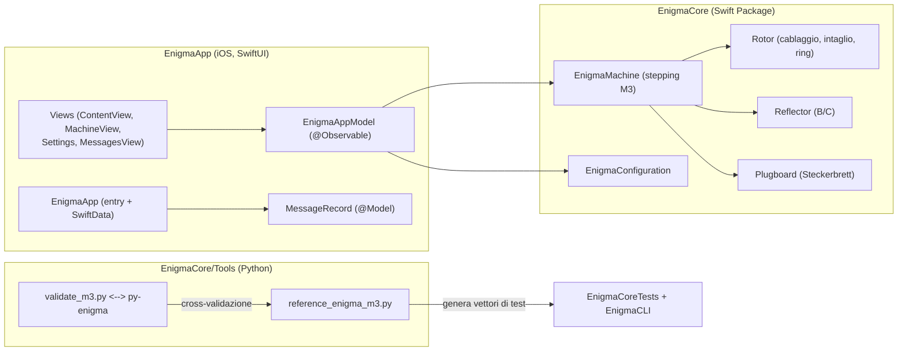

# Architettura

## Obiettivo del progetto

Simulare la **macchina Enigma M3** (Wehrmacht) in modo **storicamente fedele**,
con un'app iOS moderna (SwiftUI). Il progetto nasce (2014/2015) come
simulatore Android; questo repository ne è la **riscrittura per iOS** con un
motore migliorato e verificato.

## Perché due cartelle: `EnigmaCore` e `EnigmaApp`

La separazione è voluta ed è il pattern **"package del core + applicazione"**:

- **`EnigmaCore/`** è uno **Swift Package**. Contiene
  *solo la logica*: il motore (`Rotor`, `Reflector`, `Plugboard`,
  `EnigmaMachine`), un runner CLI e gli strumenti di validazione Python.
  Non contiene alcuna UI.
  - Vantaggi: si testa da solo con `swift test` (senza Xcode project),
    si può riusare su **macOS** (il package dichiara iOS **e** macOS) e in altri
    target (CLI, test, futuro porting desktop).
- **`EnigmaApp/`** è l'**applicazione Xcode** (SwiftUI). Dipende da EnigmaCore
  come pacchetto locale (`../EnigmaCore`) e contiene tutta la UI.

Potenzialmente tutto potrebbe stare in un solo progetto Xcode, ma si perderebbero
i **test headless del motore** e la **riusabilità**. La separazione motore/UI è
la parte più importante dell'architettura.

> La cartella del package coincide con il suo nome (`EnigmaCore`): nessuna
> ambiguità con la piattaforma iOS.

## Diagramma dei componenti



## Flusso dei dati nell'app

1. L'utente digita un testo (campo in chiaro) o tocca una lampadina della
   lampboard (`MachineView` → `EnigmaAppModel.press`).
2. `EnigmaAppModel.updateLive()` ricrea la `EnigmaMachine` dalla configurazione
   corrente e la **riproduce** sul testo in chiaro, lettera per lettera
   (`machine.keyPress`).
3. Il testo cifrato, lo stato dei rotori (`display`) e l'ultima lampadina
   accesa vengono esposti come proprietà osservabili → la UI si aggiorna.
4. La configurazione è salvata in `UserDefaults` (Codable) e i messaggi in
   **SwiftData** (`MessageRecord`).

## Configurazione e build

- **XcodeGen**: il progetto `EnigmaApp/Enigma.xcodeproj` è generato da
  `EnigmaApp/project.yml`. Dopo aver **aggiunto un file Swift** in
  `EnigmaApp/Sources/` è necessario rigenerarlo:

  ```bash
  cd EnigmaApp && xcodegen generate --spec project.yml
  ```

- **Motore**: `cd EnigmaCore && swift test` (o `swift run EnigmaCLI`).
- **App**: `open EnigmaApp/Enigma.xcodeproj` e ▶ Run.

## Vincoli

- iOS 17+ (SwiftUI `@Observable`, SwiftData).
- Il package EnigmaCore dichiara iOS 17 e macOS 14.
- Solo **iPhone** (portrait) come target di distribuzione.
