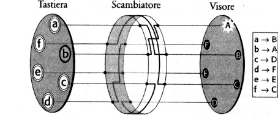

# La macchina Enigma M3 e il suo modello

Questa pagina spiega come funziona la **vera Enigma M3** e come il progetto la
simula. È la base di `EnigmaCore` (il motore).

## Contesto storico

L'Enigma era una macchina elettromeccanica di cifratura a rotori usata dalla
Wehrmacht durante la Seconda guerra mondiale. Il lavoro di **Alan Turing** e dei
crittografi di Bletchley Park per decifrarne i messaggi è uno dei capitoli più
famosi della storia della computazione.
Il modello **M3** è la versione della Heer/Luftwaffe/Kriegsmarine con **3 rotori**
scelti tra 5 (I–V) e riflettore B o C.

## Componenti fisici della macchina

```mermaid
flowchart LR
    KB[Keyboard] --> PB[Plugboard]
    PB --> ETW[Entry wheel / ETW]
    ETW --> R3[Rotore III (lento)]
    R3 --> R2[Rotore II (medio)]
    R2 --> R1[Rotore I (veloce)]
    R1 --> UKW[Reflector B/C]
    UKW --> R1 --> R2 --> R3 --> ETW --> PB --> LAMP[Lampboard]
```

Il segnale elettrico parte dalla tastiera, attraversa (da destra a sinistra)
la plugboard, il rotore veloce, il medio, il lento, il riflettore, poi torna
indietro (da sinistra a destra) e accende una lampadina.

## Le parti e il loro ruolo

| Componente | Ruolo |
| --- | --- |
| **Tastiera / Lampboard** | 26 tasti e 26 lampadine. Ogni tasto accende una lampadina diversa. |
| **Plugboard (Steckerbrett)** | Scambia coppie di lettere prima e dopo i rotori (fino a 10 cavi). |
| **Entry wheel (ETW)** | Disco di ingresso; nelle versioni militari è un passaggio dritto (identità). |
| **Rotori (Walzen)** | 3 rotori con cablaggio interno; ognuno ruota e cambia la cifratura a ogni tasto. |
| **Riflettore (UKW)** | Rispedisce il segnale attraverso i rotori; rende la cifratura **simmetrica**. |

### La plugboard (Steckerbrett)

Dieci cavi collegano coppie di prese contrassegnate da lettere. Il segnale
attraversa la plugboard **due volte**: in ingresso (dalla tastiera ai rotori)
e in uscita (dai rotori alla lampboard). Ogni cavo scambia la coppia in
entrambe le direzioni: se A è collegata a B, premere A accende la lampadina di
B e premere B accende quella di A. Il numero di modi di disporre i 10 cavi è il
contributo dominante dello spazio delle chiavi (vedi
[Il calcolo combinatorio](mathematics.md)).

### Il riflettore (UKW)

Il riflettore non ruota e non ha anello: è solo una mappa che collega ogni
lettera a un'altra, **senza mai collegarla a sé stessa**. Per questo il segnale
può sempre tornare indietro e la macchina è **involutoria** (cifratura =
decifratura): chi riceve, impostando le stesse chiavi, ridigita il cifrato e
ottiene il chiaro.

## Il cablaggio e gli intagli

Ogni rotore ha un **cablaggio** (quale contatto di sinistra è collegato a quale
pin di destra) e un **intaglio** (turnover): la posizione in cui, quando è
allineato con la leva (pawl), fa avanzare il rotore alla sua sinistra.

| Rotore | Cablaggio (contatti da A a Z) | Intaglio |
| --- | --- | --- |
| I | `EKMFLGDQVZNTOWYHXUSPAIBRCJ` | Q |
| II | `AJDKSIRUXBLHWTMCQGZNPYFVOE` | E |
| III | `BDFHJLCPRTXVZNYEIWGAKMUSQO` | V |
| IV | `ESOVPZJAYQUIRHXLNFTGKDCMWB` | J |
| V | `VZBRGITYUPSDNHLXAWMJQOFECK` | Z |

Riflettori: **B** `YRUHQSLDPXNGOKMIEBFZCWVJAT`, **C** `FVPJIAOYEDRZXWGCTKUQSBNMHL`.

## Lo stepping (meccanica)

A ogni pressione di un tasto:

1. Il **rotore veloce** (a destra) avanza **sempre** di una posizione.
2. Il **rotore di mezzo** avanza se il veloce è sull'intaglio **oppure** se è
   esso stesso sull'intaglio (**double stepping**: può avanzare due volte di
   fila).
3. Il **rotore lento** avanza se il rotore di mezzo è sull'intaglio.

Questo è il comportamento "a contachilometri" con riporto all'intaglio (non a
Z→A) che rende il periodo circa `26 × 25 × 26 ≈ 16.900` invece di 26.



### La meccanica (pawl e ratchet)

Sul fianco sinistro di ogni rotore c'è una **ruota a cricco (ratchet)**; tre
**leve (pawl)** spingono da sinistra. A ogni tasto:

- la leva del **rotore veloce** è sempre in presa → il veloce ruota sempre;
- la leva del **rotore di mezzo** entra in presa solo se l'**intaglio del
  veloce** è in posizione (la sua ruota a cricco è "alzata");
- la leva del **rotore lento** entra in presa solo se l'**intaglio del rotore
  di mezzo** è in posizione.

Il **double stepping** è una conseguenza fisica: quando il rotore di mezzo è
sul proprio intaglio, la sua stessa ruota a cricco è alzata, quindi al colpo
successivo il suo pawl lo spinge *di nuovo* (due passi di fila). Da qui il
periodo irregolare `26 × 25 × 26`.

## Ring setting (Ringstellung)

Ogni rotore ha un **anello** (ring) che può essere ruotato rispetto al
cablaggio. Il ring setting sposta sia la posizione dell'intaglio sia le lettere
mostrate nella finestrella, quindi **cambia il testo cifrato** anche a parità di
posizione. Nel modello è un offset `0–25` (0 = A, nessun offset).

## Simmetria (cifratura = decifratura)

Grazie al riflettore, la macchina è **involutoria**: con le stesse impostazioni,
cifrare due volte un testo restituisce l'originale. Per questo nell'app
"cifrare" e "decifrare" usano la stessa operazione.

## Come il progetto la simula

Il motore (in `EnigmaCore/EnigmaMachine.swift`) replica esattamente il modello
della libreria di riferimento **py-enigma** (Brian Neal, MIT):

- i rotori usano `entryMap`/`exitMap` (cablaggio e suo inverso) con posizione e
  ring setting;
- il segnale è un numero intero `0–25` che attraversa plugboard → rotori
  (destra→sinistra) → riflettore → rotori (sinistra→destra) → plugboard;
- lo stepping viene eseguito **prima** di cifrare la lettera corrente.

I dettagli per componente sono in [EnigmaCore](enigmacore.md).

## Nota sulle due varianti

- `reference_enigma.py` documenta la variante **originale dell'app Android**
  (2014/2015), in cui scattava solo il primo rotore, senza intagli né ring.
- `reference_enigma_m3.py` documenta il comportamento **M3 fedele** qui
  implementato.

## Approfondimento

- **Quante configurazioni possibili?** Vedi [Il calcolo combinatorio di
  Enigma](mathematics.md): rotori, anelli, posizioni e plugboard danno circa
  1,6 × 10²⁰ chiavi (la formula delle permutazioni).
- Componenti nel codice: [EnigmaCore](enigmacore.md).
