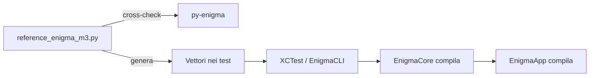

# Validazione e test

La correttezza del motore Enigma M3 è garantita da una **catena di validazioni**
a più livelli. L'ordine conta: ogni livello conferma il precedente.

## 1. Referenza Python (`reference_enigma_m3.py`)

`EnigmaCore/Tools/reference_enigma_m3.py` è un'implementazione di riferimento del
motore M3 **in Python, standalone** (solo libreria standard). Replica la
sequenza esatta di py-enigma: stepping con intagli e double stepping, poi il
segnale elettrico.

`reference_enigma.py` (nello stesso path) documenta invece la variante
**originale dell'app Android** (2014/2015), mantenuta come riferimento storico.

## 2. Cross-validazione contro py-enigma (`validate_m3.py`)

La referenza M3 è confrontata automaticamente con la libreria **py-enigma**
(Brian Neal, MIT), la più diffusa simulazione di riferimento, su:

- gli **8 vettori noti** di `TEST_CASES`;
- **centinaia di configurazioni casuali** (fuzz) con un seed deterministico.

Ogni configurazione viene costruita identicamente nelle due implementazioni
(stessa conversione ordine veloce→lento ↔ sinistra→destra, ring 1-based, ecc.).

```bash
cd Enigma
python3 -m venv .venv                      # prima volta
.venv/bin/pip install py-enigma            # prima volta
.venv/bin/python EnigmaCore/Tools/validate_m3.py --fuzz 500
```

Risultato atteso: `Tutte le 508 verifiche superate ✅`. Il venv è in `.venv/`
(gitignored) ed è una dipendenza **solo di sviluppo**: il motore Swift non ne
dipende.

## 3. Vettori di test nei test Swift

I vettori (generati dalla referenza validata) sono incorporati in:

- `EnigmaCore/Tests/EnigmaCoreTests/EnigmaMachineTests.swift`;
- `EnigmaCore/Sources/EnigmaCLI/main.swift` (stesso set, senza Xcode).

Coprono: configurazioni semplici, **ring settings**, **plugboard**, messaggi
**lunghi** che attraversano più turnover (i rotori di mezzo e lento si muovono
davvero), e un caso "QEO" (posizioni Q-E-O).

## 4. Suite XCTest (`EnigmaMachineTests`)

`cd EnigmaCore && swift test` esegue 6 test:

| Test | Cosa verifica |
| --- | --- |
| `testKnownVectors` | 13 vettori noti M3 (cifrato atteso) |
| `testReciprocity` | cifrare due volte = originale (con ring settings) |
| `testRingSettingsChangeCiphertext` | gli anelli cambiano davvero il testo |
| `testRotorsTurnOver` | dopo 17 tasti il rotore di mezzo avanza (intaglio Q) |
| `testIgnoresNonAlphabeticAndUppercases` | input normalizzato |
| `testEachCallRestartsFromSameSettings` | ogni chiamata riparte dalle impostazioni |

## 5. Runner CLI (`EnigmaCLI`)

`swift run EnigmaCLI` esegue lo stesso set di controlli con `print` e assert
manuali: utile su macchine senza Xcode completo (solo Command Line Tools).

## 6. Build dell'app

`cd EnigmaApp && xcodegen generate --spec project.yml && xcodebuild ... build`
verifica che l'app compili con il motore integrato.

## Riepilogo della catena


